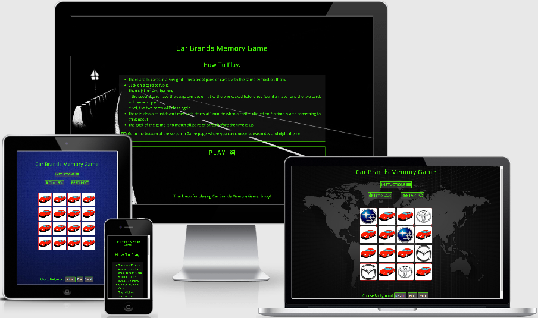

# Car Brands Memory Game

Play the game - [live link here!](https://dimitar-4.github.io/ms2-memory-game/) 

 A simple concentration card game where the player have to match pairs of cards with the same symbols on them for a limited time.
As the name suggests the symbols/logos on the cards are from different car manufacturers.

## User Experience (UX)

### User Stories:
* As a user, I want to be entertained by a simple and relaxing game.
* As a user, I expect easy to read game menu, options and features so that everything is understandable with just one look.
* As a user, I want to play a game that helps me concentrate.
* As a user, I want to play a game that can bring a possitive effect on my memory skills.
* As a user, I want to play a game that covers object that I'm iterested in.

### Strategy:

 The goal for both the user and the owner in this case are exactly the same. The goal is to give the player a pleasent experience while playing. 

### Scope: 

 The player will be provided with features such as complete "how to play" instructions, an option to choose from light and dark theme for the game backgraund, 
countdown timer.

### Structure:

  The layout it's in easy to follow logical order. Starting form a welcoming home page with a title on top, that is also a link to the game, 
 and instructions of how to play the game followed by a big start button that leads to the game.
 On the game page around the game grid are placed the player countdown timer and a restart button so that everything is easy to see and follow.

### Skeleton (Wireframes):

* On Mobile Device:
   - [Home Page](https://raw.githubusercontent.com/dimitar-4/ms2-memory-game/master/assets/wireframes/Home%20Mobile.png)
   - [Game Page](https://raw.githubusercontent.com/dimitar-4/ms2-memory-game/master/assets/wireframes/Game%20Mobile.png)
* On Desktop
   - [Home Page](https://raw.githubusercontent.com/dimitar-4/ms2-memory-game/master/assets/wireframes/Home%20Desktop.png)
   - [Game Page](https://raw.githubusercontent.com/dimitar-4/ms2-memory-game/master/assets/wireframes/Game%20Desktop.png)

### Surface:

 To create a feeling for a classic game from couple of decades ago the project is using white, 
electric green and dark gray color for the text backgrounds. This three color scheme is also combined 
with the "Play" and "Exo" Google fonts to further point the project in the desired visual direction. The
background images are chosen according to the character of the game. 

## Features

 * This memory game project is made to be responsive on different devices. 
 * The game includes a full instructions on the Home page that explains how to play.
 * It is also provides interactions not only with the game it self, 
but with changing the theme (backgraund image) on the game page so that the feel and look variates with the user's preferences. 
 * There are also couple of additional buttons like Restart/Play buttons on the Home page and above the game grid that helps navigating and interacting more easily.
 * The Car Brands Memory Game headings on both pages are links to eachother.  

## Technologies Used 

1. HTML5
2. CSS3
3. JavaScript 
4. Balsamiq
   - Used to create wireframes for the basic look of the memory game project.
5. TinyPNG
   - Used to compress the images for the backgraunds and the logos in the game.
6. Bootstrap
   - Bootstrap v4.5.3 to make the game responsive on different devices.
7. Google Fonts
   - Used "Exo" and "Play" fonts for the project.
8. Git
   - Used for version control by Gitpod's terminal commit to Git and push to GitHub.
9. GitHub
   - GitHub is where the project is stored after being pushed from Git.
10. jQuery
    - Used to simplify DOM manipulation.
11. Web Formatter
    - Used to format the code on all html, css and js files.
12. Font Awesome
    - Used to add icons to the buttons and links in the project. 

## Testing

### UX Testing
 
 By opening Car Brans Memory Game a simple easy to read entering or home page is displayed.
 The text is easy to read with good contrast to the backgraund. 
 
 Home page contains: 
 1. A Title for the game that is also a link to the game page.  
 2. "How To Play" title followed by a simple instuctions list of how to play the game, and a TIP at the end explaining how to change the theme in the game page. 
 3. Play button that is big and easy to find directly when enter the page.
 4. At the bottom of the page there is a kind sentance thanking the player for playing.

 By opening the game page a realy nice and simple layout of is loaded. The name of the game is on top. 
 Under the name there is a 60 seconds timer that starts when a card is clicked. Next to the timer is the restart game buttom. 
 Under that is the gameboard of 16 cards in a square shape. At the bottom are the change theme buttons. 
 Tha layout of the page is simple and easy to use.

 While playing the memory game, the player's focus is grabbed quickly. When the game is won a window is opening and saying "YOU WIN". 
 It is the same when the time is up but the window says "Times Up". It is helping to train 
 concentration and memory. It is also very interesting when the player is someone who likes specific car brand 
 or the idea of playing a memomry game with car brands logos. The player can be focused and at the same time relaxed 
 while playing.  

 The game was tested also from famaly and friends. All share the UX testing above and there were opinions that it's catchy and easy to forget 
 everything and enjoy a number af games at a time.      

### Code Testing

All code tests are made by direct input method.

1. The HTML code is tested on [W3C Markup Validator](https://validator.w3.org/#validate_by_input) and no errors were shown.
2. The CSS code is tested on [W3C CSS Validator](https://jigsaw.w3.org/css-validator/#validate_by_input) and no errors were shown.
3. The JavaScript code is tested on [JS Hint](https://jshint.com/) and warnings were shown but not errors in the code.

### Browsers testing

No problems were shown while testing the game. 

* Chrome
* Opera 
* Edge

### Device Testing

The game is tested on different devices to check if it is responsive and if it shows any problems.

Mobile devices tested:
* Samsung Galaxy S20 FE
* Xiomi Note 5
* Samsung Galaxy A51

Other devices tested:
* Acer Aspire 5 A515-51G
* Acer B7 series-B277(Desktop Monitor)

Adding screenshots from mobile devices:

* [Samsung Galaxy S20 FE](https://raw.githubusercontent.com/dimitar-4/ms2-memory-game/master/assets/test-images/samsung-s20fe.jpg)
* [Huawei Mate 10 Pro](https://raw.githubusercontent.com/dimitar-4/ms2-memory-game/master/assets/test-images/huawei-mate10-pro.jpg)

Adding screenshots from developer tools responsive testings:

* [IPad](https://raw.githubusercontent.com/dimitar-4/ms2-memory-game/master/assets/test-images/ipad-test.PNG)
* [Motorola G4](https://raw.githubusercontent.com/dimitar-4/ms2-memory-game/master/assets/test-images/moto-g4.PNG)
* [IPhone](https://raw.githubusercontent.com/dimitar-4/ms2-memory-game/master/assets/test-images/iphone-test.PNG)
* [Surface Duo](https://raw.githubusercontent.com/dimitar-4/ms2-memory-game/master/assets/test-images/surface-duo.PNG)

### Links Testing

All inner links and buttons are tested. No problems were shown.

### Problems

While testing the game there are some problems that are left to be fixed in the future.
The pop up windows must be closed manually and the goal for them is to be displayed for couple of seconds 
and close automatically. Also already played cards can be played again wich is a problem to fix in the future.
This problems are noted wile the testing period. 

## Deployment

Deploying the Car Brands Memory Game website to GitHub Pages from its GitHub repository, was in the following order:

1. Log into GitHub.
2. From the list of repositories on the screen, select ms2-memory-game.
3. From the menu items near the top of the page, select Settings.
4. Scroll down to the GitHub Pages section.
5. Under Source click the drop-down menu labelled None and select Master Branch
6. When Master Branch is selected press the Save button on the right and the page is automatically refreshed, the website is now deployed.
7. Scroll back down to the GitHub Pages section to retrieve the link to the deployed website.
8. Run the link in the browser to open the website.

## Credits

### Content

* All the text in the content of the Car Brands Memory Game is written by the developer.
* These video tutorials [here](https://www.youtube.com/watch?v=bbb9dZotsOc&ab_channel=WebDevJunkie),
 and [here](https://www.youtube.com/watch?v=tjyDOHzKN0w&t=8s&ab_channel=CodewithAniaKub%C3%B3w%23JavaScriptGames) had a big inpact on my project game. 
* CSS code for the 3D shadow effect when hovering over the game cards is found [here](https://www.webdesignerdepot.com/2014/05/8-simple-css3-transitions-that-will-wow-your-users/). 
* The source for the countDown function in the script.js file is from [this](https://stackoverflow.com/questions/35299413/1-min-countdown-javascript) stack overflow page. 

### Media

* The background images are downloaded from [Wallpapercave](https://wallpapercave.com/) and [Freepik](https://www.freepik.com/).
* The car manufactuters logo images are downloaded from [Pinterest](https://www.pinterest.com/).
* The card-back image is downloaded from [here](https://365psd.com/).
* The responsive image on different devices is made [here](http://ami.responsivedesign.is/).

### Acknowledgements

* The inspiration for this project came from my best friend's son who loves to guess car brands logos so I started this project with him in mind.
* Akshat Garg (my mentor) - THANK YOU for all advices, guidance and feedback getting me through the hole process.
* All platforms and libraries that helped me in fixing all kinds of issues: Slack, Stack Overflow, Youtube, W3Schools. 